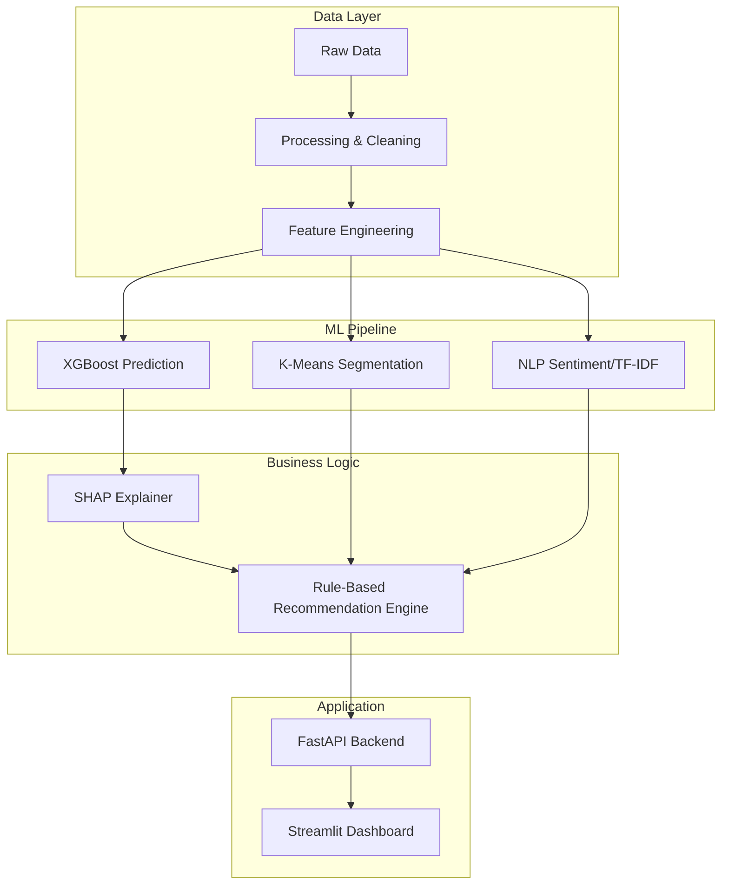

# RetentionIQ

**Customer Intelligence & Retention Platform**
*Predict risk. Understand why. Act before customers leave.*

## Business Problem
Subscription businesses lose millions annually to preventable churn. RetentionIQ solves this by taking raw customer data (usage, support tickets, billing) and turning it into actionable, prioritized intelligence for Customer Success teams.

## Architecture

## Quickstart (Local)
1. `pip install -r requirements.txt`
2. `make all` (Generates data and trains the model)
3. `make api` (Starts FastAPI on port 8000)
4. `make dashboard` (Starts Streamlit on port 8501)

## Quickstart (Docker)
`docker compose up --build`

## Key Features
- **Predictive Churn Model**: XGBoost trained with SMOTE.
- **Explainable AI (SHAP)**: Understand exactly *why* a customer is at risk.
- **NLP Analysis**: Understand sentiment and trending issues in support tickets.
- **Actionable Recommendations**: Business logic engine translating ML output into CSM tasks.
